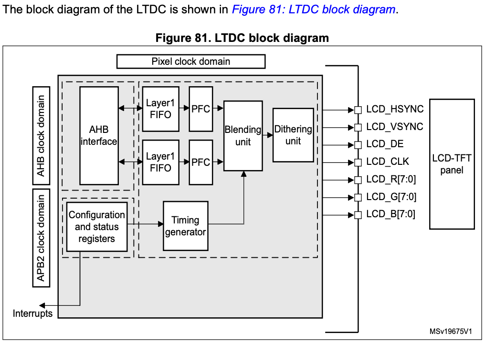
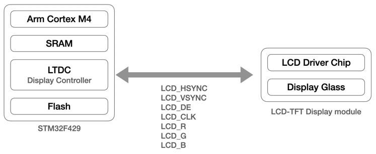
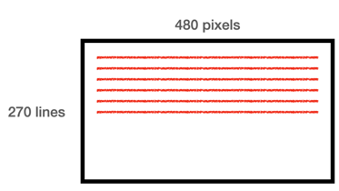

# LCD, LTCD, LVGL

This is the development log for STM32 display module.
In this document, there are some introduction, basic 

## LTC-TFT Display controller
Configure and enable the LTCD peripheral (LCD-TFT Display controller)
of the microcontroller
- LTCD of the MCU generates all synchronization and timing signals and
  transfers RGB components to the display
- Display which has a display driver chip that interprets those signals
  and drives the display panel to light the desired pixels

The processor is actually not involved. LTCD does that.

## Display interface types
- MIPI DPI (Display Pixel Interface)
- MIPI DBI (Display Bus Interface / MCU interface)
- MIPI DSI (Display Serial Interface)

### MIPI (Mobile Industry Processor Interface) Alliance
- MIPI Alliance develops interface specifications for mobile and mobile-influenced devices
- In the mobile industry, companies use MIPI alliance specifications when developing smartphone,
  tablets, laptops, and hybrid devices

### MIPI DIP
- This is also called as RGB interface
- Applies to display which uses 16/18/24-bit data lines and control signals
- The MIPI DPI specification standardizes the data and control signals to be used by manufacturers of
  mobile device processors, cameras and display
- The DPI interface is typically used when the display module doesn't support the frame buffer.
  The host controller must stream the data in read-time to the display
- The host processor interface must implement a 24-bit data width and accompanying control and timing
  signals. The host processor must be capable of transferring data as 16/18/24 bit words

### MIPI DBI (Display Bus interface)
- Also known as MCU interface
- The MIPI-DBI used to interface with a display module with an integrated graphic RAM(GRAM). Ths pixel
  data is first updated in the local GRAM of the display driver chip which repeatedly refreshes the
  display
- Host and display module can be connected by simple GPIOs
- Types of MIPI-DBI are:
  - DBI type A: based on motorola 6800 bus
  - DBI type B: based on intel 8080 bus
  - DBI type C: based on SPI protocol

### RGB Interface:
- Vsync:
  - This is a vertical synchronization signal sent from the host display controller (LTDC) to the display
    module
  - This signal marks the "start of a new frame". That means, when this signal asserts, the display module
    understands that the host controller is going to send a new frame
- Hsync
  - This is a horizontal synchronization signal sent from the host display controller to the display module
  - This signal marks the "start of a new line of the frame". That means, then this signal asserts, the display
    module understands that the host controller will send a new line of the current frame

E.g.

In this picture, Vsync toggles one time, and hsync toggles 270 times.

- DE:
  - This is sent from the host controller and indicates whether the RGB data is valid or not
  - When `DE = 0`, the display module doesn't read the RGB data because it is invalid
  - When `DE = 1`, the display module reads the RGB data and displays it
- DOTCLK (PCLK)
  - The clock signal is sent from the host controller(LTDC) to read the RGB data when `DE = 1`; Display
    module reads the RGB data during the rising edge of DOTCLK. This is also indicates how fast RGB data
    is made available to the display module
- RGB data lines:
  - The host controller must support 24 bit data lines to carry RGB data. The display modules samples these
    data lines only when `DE=1` during rising edge of DOTCLK. Note that the display module does not need to 
    support 24 data lines to accept RGB data. You have to check the display module's pin capability while
    interfacing.

## Implement the LTDC driver

## LGVL
About LGVL
Using simulator
Executing LVGL sample applications on the simulator
Adding LVGL source code to the STM32 project
Adding LCD-TFT and touchscreen driver support
Executing LVGL sample applications on target hardware